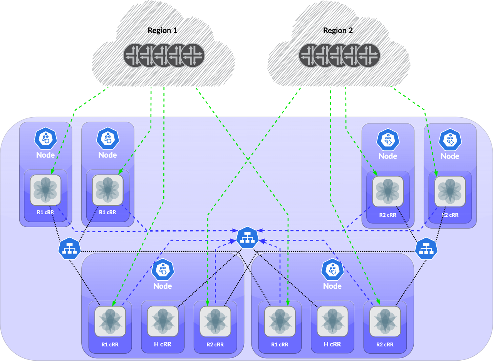

# meshrr

## Introduction
*meshrr* is a demonstration-grade scale-out, hierarchically-capable, BGP route reflection methodology using Juniper cRPD and intended for deployment on Kubernetes.

At this time and in the project's raw form, *meshrr* should not be considered for production environments. Sufficient testing, error handling, and routing daemon configuration best practices have not been implemented. Community contributions to improve these areas are appreciated.

- [meshrr](#meshrr)
  - [Introduction](#introduction)
  - [Instructions](#instructions)
    - [Prerequisites](#prerequisites)
    - [Quickstart](#quickstart)
    - [Environment Variables](#environment-variables)
  - [Methodology](#methodology)
- [Examples](#examples)
  - [2 Regions with Hierarchical Route Reflectors](#2-regions-with-hierarchical-route-reflectors)
    - [Description](#description)
    - [Usage](#usage)

## Instructions

### Prerequisites
1. An operational Kubernetes cluster with sufficient resources for the topology you wish to build.
2. A *private* container registry accessible to your Kubernetes cluster.
   - You'll need to be logged in to your registry using `docker login` to push the image you'll build.
   - You'll need to store your registry credentials in a secret in your cluster to pull from this registry. In this project, all examples use a secret named `regcred`. There are a few ways you can do this.
     1. If you already have a simple means of generating the secret manifest (e.g. using `doctl`), you can do this in one line:
        ```
        doctl registry kubernetes-manifest --name regcred | kubectl apply -f -
        ```
     2. You can generate the secret manually with all the parameters:
        ```
        kubectl create secret docker-registry regcred \
          --docker-server=<server> --docker-username=<username> \
          --docker-password=<password> --docker-email=<email>
        ```
     3. Any number of [other reasonable approaches](https://kubernetes.io/docs/tasks/configure-pod-container/pull-image-private-registry/).

3. A cRPD license for the number of nodes you wish to deploy. At the time of writing, Juniper offers [free trial licenses](https://www.juniper.net/us/en/dm/crpd-trial/). Standard licenses are limited to 16 BGP peers and 4M RIB entries.

### Quickstart
1. (If required) modify [`juniper.conf.j2`](meshrr/juniper.conf.j2)
2. Build and push your image. **Do not push to a public registry.**

    ```bash
    docker build -t <tag> meshrr
    docker push <tag>
    ```

    e.g.
    ```bash
    docker build meshrr -t registry.example.com/meshrr/meshrr:latest
    docker push registry.example.com/meshrr/meshrr:latest
    ```
3.  Either:
    1. Pick an example topology from [`examples`](examples/) and modify the YAML files as required for your topology. Details for how to use examples and reasonable modifications are below in the [Examples](#Examples) section.
    2. Create your own YAML files if you need a completely custom topology.
4.  Populate the YAML files with the required information. You will need to, at a minimum, replace the following:
    1. Names
      1.  Service
      2.  Labels (if following the 2regions-hrr example, your regions probably are not in Middle Earth)
    2. [Environment Variables](#Environment-Variables)
    3. Licensing mechanism. Examples here currently use a secret mounted as a volume mapped to `/config/license/safenet/junos_sfnt.lic`. This may be appropriate for bundle licenses where it is appropriate to use the same license file for many similar devices in a deployment or daemonset. You can create this using:
      ```
      kubectl create secret generic crpd-license --from-file=junos_sfnt.lic=<filepath>
      ```
    4. Custom configuration Jinja2 templates loaded into ConfigMaps and mapped as volumes. See [Examples](#Examples).
    5. Port mapping IP addresses (`hostIP`). No `hostIP` must be specified for instances only accessible within the cluster. Detailed strategy information to be defined in [Examples](#Examples).
5.  Apply appropriate labels to the nodes:
    ```bash
    kubectl label nodes <node> <label1>=<value> <label2>=<value>
    ```
6.  Apply your configuration:
    ```bash
    kubectl [-n namespace] apply -f <file1>
    kubectl [-n namespace] apply -f <file2>
    ```

### Environment Variables
| Variable              | Required? | Description                                                                                                                                                                                                                                                                                                  |
| --------------------- | --------- | ------------------------------------------------------------------------------------------------------------------------------------------------------------------------------------------------------------------------------------------------------------------------------------------------------------ |
| POD_IP                | Yes       | The pod's IP address. Should be set by Kubernetes (`valueFrom: fieldRef: fieldPath: status.podIP`)                                                                                                                                                                                                           |
| MESH_SERVICE_NAME     | Yes*      | The name of the mesh service. Set to the name of the headless Kubernetes service used for mesh BGP neighbor discovery. *Usually, a `MESH_SERVICE_NAME` is desirable. However, it may be skipped if there is an `UPSTREAM_SERVICE_NAME` in cases such as unmeshed regions learning routes from upstream HRRs. |
| UPSTREAM_SERVICE_NAME | No        | The name of the upstream service. Set to the name of the headless Kubernetes service used for upstream BGP neighbor discovery. Defaults to `None`.                                                                                                                                                           |
| KUBE_NAMESPACE        | No        | Optional name of the Kubernetes namespace. Defaults to `default`.                                                                                                                                                                                                                                            |
| ENCRYPTED_ROOT_PW     | Yes       | Encrypted ($6) root password for cRPD                                                                                                                                                                                                                                                                        |
| AUTONOMOUS_SYSTEM     | Yes       | ASN for the router.                                                                                                                                                                                                                                                                                          |
| MESHRR_CLIENTRANGE    | Yes       | Range to allow. Currently, this accepts only one CIDR block. Format: `network/mask-length`                                                                                                                                                                                                                   |
| SERVICE_ROOT_DOMAIN   | No        | Defaults to `svc.cluster.local`. You probably don't need to change this.                                                                                                                                                                                                                                     |

## Methodology
- Build container image based on crpd.
    - Requires additional packages installed via `apt-get`:
      - cron
      - python3
    - Builds crontab
    - Sets up `runit-init.sh`
- `runit-init.sh` initializes the environment:
  - Saves environment variables, including the necessary pod's IP address, to `/etc/envvars`
  - Sets up the cRPD configuration based on the template `juniper.conf.template`
  - Calls `render_config.py` to create configuration file from Jinja2 template.
- `update_peers.py` called every minute via cron.
  - Uses a Kubernetes headless service DNS A records to detect peers.
  New peers are added to config, removed peers are removed from config.
  - Only occurs once a minute, so, given BGP timers, assume pod readiness 100 seconds from initiation.

# Examples

## 2 Regions with Hierarchical Route Reflectors



* Example YAML files: [examples/2regions-hrr](examples/2regions-hrr)

### Description
* This topology has two regions, `mirkwood` and `lothlorian`, and a `core` region.
* Within a region, all cRRs (containerized route reflectors) are fully meshed to provide maximum visibility within the region.
* All cRRs in a region other than `core` have BGP peerings with up to 2 `core` cRRs. (The limit of 2 is hard coded on upstream peer groups.)
* **Redundancy groups and anycast addressing:**
  * Each node is assigned to redundancy group `a` or `b`.
  * For each region with neighbors outside the cluster, separate DaemonSets are created for `a` and `b`, each with a unique IP address for that [meshrr_region:redundancy_group] combination. This IP address is used for iBGP peering with neighbors outside the cluster.
  * Each /32 is assigned to the loopback interface of *every* node in the [meshrr_region:redundancy_group] combination, and the routers connecting to the node have a static route to the /32 that is redistributed into the IGP. For example, in the above topology:
    
    | Node Region | MESHRR_REGION(s)           | Redundancy Group | Loopback Address(es)   |
    | ----------- | -------------------------- | ---------------- | ---------------------- |
    | Mirkwood    | mirkwood                   | a                | 172.19.1.1             |
    | Mirkwood    | mirkwood                   | b                | 172.19.1.2             |
    | Core        | core, mirkwood, lothlorien | a                | 172.19.1.1, 172.19.2.1 |
    | Core        | core, mirkwood, lothlorien | b                | 172.19.1.2, 172.19.2.2 |
    | Lothlorien  | lothlorien                 | a                | 172.19.2.1             |
    | Lothlorien  | lothlorien                 | b                | 172.19.2.2             |

### Usage
1.  Follow the instructions in [Quickstart](#Quickstart) using the example YAML files in [examples/2regions-hrr]().

2.  Create the necessary loopback IPs on each of the nodes based on redundancy group and region. Internal-only MESHRR_REGIONs do not require a configured loopback IP.

    ```bash
    sudo ip address add 172.19.1.1 dev lo
    ```

3.  Configure your routers servicing the nodes with static routes redistributed into your IGP for the node loopback addresses.
Configuration on the router servicing a Mirkwood A node may look like:

    ##### Junos
    ```junos
    routing-options {
        static {
            route 172.0.1.1/32 next-hop <Node IP>;
        }
    }
    policy-options {
        policy-statement RRSTATIC-TO-ISIS {
            from {
                protocol static;
                route-filter 172.19.1.1/32 exact;
            }
            then accept;
        }
    }
    protocols {                              
        isis {
            export RRSTATIC-TO-ISIS;
        }
    }
    ```

    ##### IOS-XR
    ```iox-xr
    router static
      address-family ipv4 unicast
      172.0.1.1/32 <Node IP>
    !
    route-policy STATIC-TO-ISIS
      if destination in (172.19.1.1/32) then
        pass
      endif
    end-policy
    !
    router isis ISIS
      redistribute static level-2 route-policy STATIC-TO-ISIS
    !
    ```

4.  Modify configuration templates as necessary. [`meshrr/juniper.conf.j2`](meshrr/juniper.conf.j2) will be loaded to all instances by default, but customizations on a per-deployment/per-daemonset basis should be performed on other J2 files (see [`mirkwood-config.j2`](examples/2regions-hrr/templates/mirkwood-config.j2) and [`lothlorien-config.j2`](examples/2regions-hrr/templates/lothlorien-config.j2).
Apply these configuration templates as ConfigSets for any cases that require customization as so:

    ```bash
    k create configmap mirkwood-config \
      --from-file=config=examples/2regions-hrr/templates/mirkwood-config.j2 \
      -o yaml --dry-run=client |
      k apply -f -
    ```

    ```bash
    k create configmap lothlorien-config \
      --from-file=config=examples/2regions-hrr/templates/lothlorien-config.j2 \
      -o yaml --dry-run=client |
      k apply -f -
    ```

    These ConfigMaps are mounted as volumes in the corresponding DaemonSets.

5.  Modify the YAML files to your needs. At the least, `<registryURL>` will need to be replaced to reference your private registry. Load the YAML files for the DaemonSets and Services into Kubernetes as per [Quickstart](#Quickstart).
