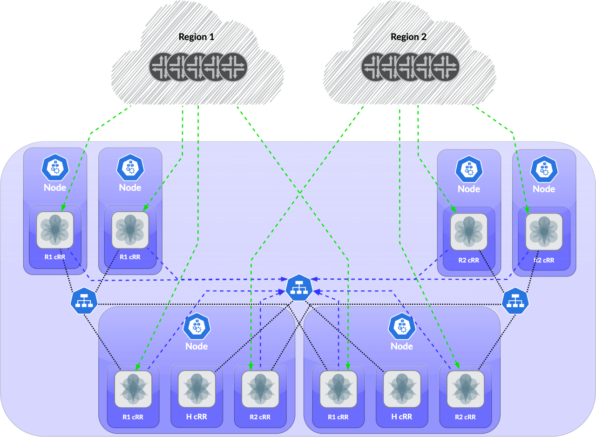
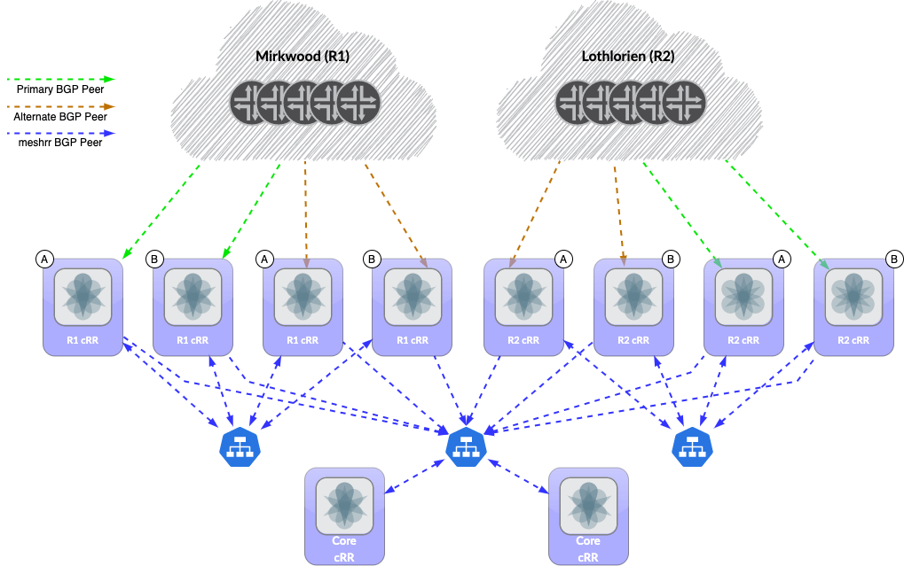

# Example: 2 Regions with Hierarchical Route Reflectors



## Description
* This topology has two regions, `mirkwood` and `lothlorian`, and a `core` region.
* Within a region, all cRPDs are fully meshed via iBGP to provide maximum visibility within the region.
* All cRPDs in a region other than `core` have BGP peerings with up to 2 `core` cRPDs. The `core` cRPDs serve as route reflectors for the non-core regions. (The limit of 2 is hard coded on upstream peer groups.)
* **Redundancy groups and anycast addressing:**
  * Each node is assigned to redundancy group `a` or `b`.
  * For each region with neighbors outside the cluster, separate DaemonSets are created for `a` and `b`, each with a unique IP address for that [meshrr_region:redundancy_group] combination. This IP address is used for iBGP peering with neighbors outside the cluster.
  * For Lothlorien:
    * Kubernetes nodes run MetalLB.
    * MetalLB eBGP peers to each connected router on a loopback with the same IP address (10.0.0.0).
    * meshrr pods are assigned to a Kubernetes service using the MetalLB load balancer. This service is configured with `externalTrafficPolicy: local` and MetalLB announces the /32 of the service only from nodes with a corresponding meshrr pod, which will act as a route reflector for routers outside the cluster.
    * This is the preferred method of distributing routes to the route reflector as it dynamically advertises based upon where route reflectors exist.
  * For Mirkwood:
    * Each /32 is assigned to the loopback interface of *every* node in the [meshrr_region:redundancy_group] combination.
    * Routers connecting to the node have a static route to the /32 that is redistributed into the IGP.
    * This method is discouraged but illustrates an alternative option. It provides no assurance that the route reflector is operational before advertising routes, as it relies on static routes from the connected router. Such a method could be enhanced using event scripts or similar, but the method used in Lothlorien provides more native dynamic routing.
  * In the above topology:
    | Node Region | MESHRR_REGION(s)           | Redundancy Group | Loopback Address(es)   | MetalLB IP(s) |
    | ----------- | -------------------------- | ---------------- | ---------------------- | ------------- |
    | Lothlorien  | lothlorien                 | a                |                        | 172.19.1.1    |
    | Lothlorien  | lothlorien                 | b                |                        | 172.19.1.2    |
    | Core        | core, mirkwood, lothlorien | a                | 172.19.2.1             | 172.19.1.1    |
    | Core        | core, mirkwood, lothlorien | b                | 172.19.2.2             | 172.19.1.2    |
    | Mirkwood    | mirkwood                   | a                | 172.19.2.1             |               |
    | Mirkwood    | mirkwood                   | b                | 172.19.2.2             |               |

### Usage
1.  Follow the instructions in [Quickstart](../../README.md#Quickstart) using the example YAML files in [examples/2regions-hrr](.).

2.  Create the necessary loopback IPs on each of the nodes based on redundancy group and region. Internal-only MESHRR_REGIONs do not require a configured loopback IP.

    ```bash
    sudo ip address add 172.19.1.1 dev lo
    ```

3.  Configure the Lothlorien routers connected to the nodes with:
    *  The anycast peering address for MetalLB to peer to on the loopback
    *  Hardcoded router ID (to ensure that the anycast peering address does not become the router ID)
    *  BGP peering
    *  Redistribution of RR routes from BGP to IGP
    ```junos
    set interfaces lo0 unit 0 family inet address 10.0.0.0/32
    set protocols bgp group RR-LOADBALANCER type external
    set protocols bgp group RR-LOADBALANCER multihop ttl 2
    set protocols bgp group RR-LOADBALANCER local-address 10.0.0.0
    set protocols bgp group RR-LOADBALANCER peer-as 65001
    set protocols bgp group RR-LOADBALANCER allow 172.19.0.0/24
    set protocols bgp group RR-LOADBALANCER import NO-ADVERTISE
    set protocols isis export FILTER-RRLBPEER
    set protocols isis export REDISTRIBUTE-RRS
    set policy-options policy-statement FILTER-RRLBPEER from protocol direct route-filter 10/32 exact
    set policy-options policy-statement FILTER-RRLBPEER then reject
    set policy-options community no-advertise members no-advertise
    set policy-options policy-statement NO-ADVERTISE then community add no-advertise
    set policy-options policy-statement REDISTRIBUTE-RRS from protocol bgp route-filter 172.19.1.0/24 prefix-length-range /32-/32
    set policy-options policy-statement REDISTRIBUTE-RRS then accept
    ```

4.  Configure the Mirkwood routers connected to the nodes with static routes redistributed into your IGP for the node loopback addresses.
Configuration on the router servicing a Mirkwood A node may look like:

    ##### Junos
    ```junos
    routing-options {
        static {
            route 172.19.2.1/32 next-hop <Node IP>;
        }
    }
    policy-options {
        policy-statement RRSTATIC-TO-ISIS {
            from {
                protocol static;
                route-filter 172.19.2.1/32 exact;
            }
            then accept;
        }
    }
    protocols {                              
        isis {
            export RRSTATIC-TO-ISIS;
        }
    }
    ```

    ##### IOS-XR
    ```iox-xr
    router static
      address-family ipv4 unicast
      172.19.2.1/32 <Node IP>
    !
    route-policy STATIC-TO-ISIS
      if destination in (172.19.2.1/32) then
        pass
      endif
    end-policy
    !
    router isis ISIS
      redistribute static level-2 route-policy STATIC-TO-ISIS
    !
    ```

5.  Modify configuration templates as necessary. [`meshrr/juniper.conf.j2`](../../meshrr/juniper.conf.j2) will be loaded to all instances by default, but customizations on a per-deployment/per-daemonset basis should be performed on other J2 files (see [`mirkwood-config.j2`](templates/mirkwood-config.j2) and [`lothlorien-config.j2`](templates/lothlorien-config.j2).
Apply these configuration templates as ConfigSets for any cases that require customization as so:

    ```bash
    k create configmap mirkwood-config \
      --from-file=config=examples/2regions-hrr/templates/mirkwood-config.j2 \
      -o yaml --dry-run=client |
      k apply -f -
    ```

    ```bash
    k create configmap lothlorien-config \
      --from-file=config=examples/2regions-hrr/templates/lothlorien-config.j2 \
      -o yaml --dry-run=client |
      k apply -f -
    ```

    These ConfigMaps are mounted as volumes in the corresponding DaemonSets.

6.  Modify the YAML files to your needs. At the least, `<registryURL>` will need to be replaced to reference your private registry. Load the YAML files for the DaemonSets and Services into Kubernetes as per [Quickstart](../../README.md#Quickstart).